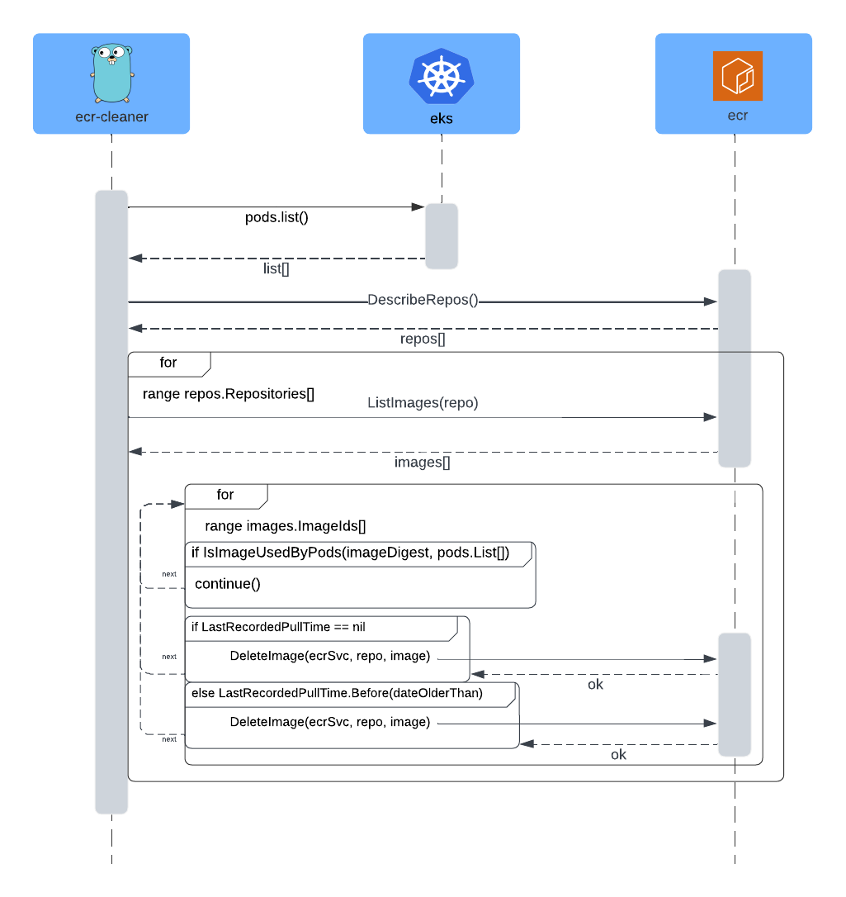

# ECR Cleaner

This project is a Go application designed to manage Amazon ECR (Elastic Container Registry) images. It identifies and lists images that are either "never pulled" or "older than a specified number of days," and provides the option to delete these images. The application runs within a Docker container and is scheduled as a Kubernetes CronJob.

## Prerequisites

- Go 1.20 or higher
- Docker
- Kubernetes cluster

## Usage
```
./ecr-cleaner
```

### flags
| flag | usage |
| ---- |---- |
| days | allows users to specify a number of days to compare against the lastPulledTime of each image. By default, this value is set to 365 days, meaning the application will identify and process images that have not been pulled within the past year.|
| region | Specifies the AWS region for the ECR service. |
| mode | Defines the execution mode (ecr for external cron job, k8s for running within Kubernetes). |

### aws-profile
The binary will use what you have set as your `AWS_PROFILE`

## Setup
### Building the Go Binary

To build the Go binary:

```sh
make build
```

## Building the Docker Image
To build the Docker image:
```sh
make docker
```
## Building and Pushing the Docker Image
To build the Docker image and push it to the Docker repository:
```sh
make build-and-push
```

## Cleaning Up
To remove build artifacts:
```sh
make clean
```

## Pushing Docker Image to Repository
To push the Docker image to the repository:
```sh
make push
```

## Run as a cronjob within an EC2 instance
1. Build the Go Binary
```
GOOS=linux GOARCH=amd64 go build -o /path/to/ecr-cleaner /path/to/main.go
```
2. Transfer the Binary to the Linux Instance
```
scp /path/to/ecr-cleaner user@linux-instance:/path/to/destination
```
3. Set Up the Environment
```
chmod +x /path/to/destination/ecr-cleaner
```
* If your binary requires AWS credentials or environment variables, set them appropriately in the user's profile (~/.bashrc, ~/.profile) or within the cron job itself.
4. Create a Shell Script for the Cron Job (Optional but Recommended)
```
#!/bin/bash

# Set environment variables, if needed
export AWS_ACCESS_KEY_ID="your-access-key-id"
export AWS_SECRET_ACCESS_KEY="your-secret-access-key"

# Run the binary with required arguments
/path/to/destination/ecr-cleaner -days=365 -region=us-east-1 -mode=ecr

# Redirect logs if needed
# /path/to/destination/ecr-cleaner -days=365 -region=us-east-1 -mode=ecr >> /path/to/logs/ecr-cleaner.log 2>&1
```
Make the script executable:
```
chmod +x /path/to/destination/run_ecr_cleaner.sh
```
5. Set Up the Cron Job
Open crontab editor and add a new entry at the end of the file
```
crontab -e

# Run every Saturday at 3 AM
0 3 * * 6 /path/to/destination/run_ecr_cleaner.sh
```
* Alternatively, if you prefer running the binary directly in the cron job without a script, add the following:
```
# Run every Saturday at 3 AM
0 3 * * 6 /path/to/destination/ecr-cleaner -days=365 -region=us-east-1 -mode=ecr >> /path/to/logs/ecr-cleaner.log 2>&1
```

## Run in k8s as a cronjob
To run your Go binary as a Kubernetes cron job, you will need to create a Kubernetes CronJob resource. This resource will schedule your binary to run at specified intervals, similar to how cron jobs work on Unix-like systems.

Here's a step-by-step guide to set this up:

1. Create a Docker Image of Your Go Binary
First, you need to containerize your Go application by building a Docker image. Here's a basic Dockerfile:
```
# Use the official Golang image as a builder
FROM golang:1.20 AS builder

# Set the Current Working Directory inside the container
WORKDIR /app

# Copy go mod and sum files
COPY go.mod go.sum ./

# Download all dependencies. Dependencies will be cached if the go.mod and go.sum files are not changed
RUN go mod download

# Copy the source from the current directory to the Working Directory inside the container
COPY . .

# Build the Go app
RUN go build -o /ecr-cleaner

# Start a new stage from scratch
FROM alpine:latest

# Copy the Pre-built binary file from the previous stage
COPY --from=builder /ecr-cleaner /ecr-cleaner

# Command to run the executable
ENTRYPOINT ["/ecr-cleaner"]
```
Build and push the image to a container registry (like Docker Hub, ECR, GCR, etc.):
```
docker build -t your-repo/ecr-cleaner:latest .
docker push your-repo/ecr-cleaner:latest
```
2. Create a Kubernetes CronJob YAML File
Next, create a cronjob.yaml file to define the Kubernetes CronJob. Here is an example configuration:
```
apiVersion: batch/v1
kind: CronJob
metadata:
  name: ecr-cleaner-cronjob
spec:
  schedule: "0 3 * * 6" # Runs every Saturday at 3 AM
  jobTemplate:
    spec:
      template:
        spec:
          containers:
          - name: ecr-cleaner
            image: your-repo/ecr-cleaner:latest
            args:
            - "-days=365"
            - "-region=us-east-1"
            - "-mode=k8s" # we are running within the cluster
            env:
            - name: AWS_ACCESS_KEY_ID
              valueFrom:
                secretKeyRef:
                  name: aws-credentials
                  key: accessKeyId
            - name: AWS_SECRET_ACCESS_KEY
              valueFrom:
                secretKeyRef:
                  name: aws-credentials
                  key: secretAccessKey
          restartPolicy: OnFailure
      backoffLimit: 3
```
3. Deploy the CronJob to Kubernetes
```
kubectl apply -f cronjob.yaml
```
4. Verify the CronJob Deployment
```
# List all CronJobs
kubectl get cronjobs

# Describe the CronJob for detailed information
kubectl describe cronjob ecr-cleaner-cronjob

# Check the logs of the latest job
kubectl get jobs
kubectl logs <job-pod-name>
```

### Additional Considerations
* Secrets Management: Ensure that AWS credentials are stored securely in Kubernetes secrets, and referenced correctly in the CronJob YAML file.
* Monitoring and Logging: Use Kubernetes logging and monitoring tools (like Prometheus, Grafana, or ELK stack) to track the CronJob's performance and troubleshoot issues if needed.
* Error Handling: Adjust the backoffLimit and restartPolicy according to how resilient you want the job to be in case of failures.

## EKS
If running this as a k8s object confirm the cluster has access to ECR service.

### IAM role
By default, Amazon EKS (Elastic Kubernetes Service) can access Amazon ECR (Elastic Container Registry) images without needing to add an additional role.
Ensure your EKS cluster nodes have permissions to interact with ECR, such as `ecr:DescribeRepositories`, `ecr:ListImages`, `ecr:DescribeImages`, and `ecr:BatchDeleteImage`.

## UML
